[](https://www.google.com/preferences/source?q=dalam.web.id)
[](readme-en.md)

# 🚀 Panduan Membuat Static Site

Selamat datang! Panduan ini menjelaskan cara membangun situs statis yang cepat, ringan, dan **ter-deploy secara otomatis ke Cloudflare Pages** menggunakan repository **Layar Kosong**.

[](https://github.com/frijal/LayarKosong/fork)

Konsepnya sederhana: kamu cukup fokus menulis dan melakukan commit ke GitHub. Seluruh proses build, generate aset, pemrosesan artikel, sinkronisasi indeks pencarian, hingga deployment ditangani otomatis oleh **GitHub Actions + Bun.js + Cloudflare Wrangler**.

**Fitur Utama:**

* **Single Pipeline:** Seluruh proses publikasi berada dalam satu workflow GitHub Actions, yaitu `📡 Artikel Baru Kombo`, dengan tiga fase berurutan.
* **Direct Deploy:** Deployment dilakukan langsung ke Cloudflare Pages menggunakan Wrangler, tanpa branch `site` sebagai perantara.
* **Search Engine:** Mesin pencarian client-side menggunakan data `artikel.json` dan indeks pencarian pada Cloudflare D1.
* **Clean URLs:** Mendukung URL tanpa ekstensi `.html` untuk struktur navigasi yang lebih bersih.
* **Image Optimization:** Pemrosesan gambar, WebP, dan varian `srcset` dilakukan sebagai bagian dari pipeline produksi.

---

## 🧠 Arsitektur Otomatisasi (CI/CD)

Bagaimana **Layar Kosong** mengubah artikel di staging menjadi halaman yang siap dipublikasikan?

Saat ini repository menggunakan **satu workflow**:

`📡 Artikel Baru Kombo`

Workflow tersebut dibagi menjadi tiga fase yang berjalan berurutan dalam **satu job**:

1. **🔰 Fase 1 — Proses ArtikelX**
2. **🏗️ Fase 2 — Build & Generate Site Files**
3. **🚀 Fase 3 — Prepare, Sync D1 & Deploy Cloudflare Pages**

Trigger otomatis utamanya adalah push ke branch `main` yang mengubah file `artikelx/*.html`. Workflow juga menyediakan `workflow_dispatch` untuk menjalankan bagian tertentu secara manual.

### Diagram Pipeline

```mermaid
graph TD
    Start(((Push / Manual))) --> Trigger{"Trigger"}

    Trigger -->|Push ke main<br>artikelx/*.html| Phase1
    Trigger -->|workflow_dispatch| Manual["Pilih toggle proses<br>dan deploy_mode"]

    Manual --> Phase1

    subgraph WF["📡 Workflow: Artikel Baru Kombo"]
        direction TB

        Phase1["🔰 Fase 1<br>Proses ArtikelX"]
        A1["Edit-Komponen-HTML.ts"]
        A2["gantifontshighlight.ts"]
        A3["seo-fixer.ts"]
        A4["Move artikelx/ → artikel/<br>+ local commit"]

        Phase1 --> A1 --> A2 --> A3 --> A4

        A4 --> Phase2["🏗️ Fase 2<br>Build & Generate"]
        B1["generator-pro.ts<br>artikel.json + XML + RSS"]
        B2["srcset-generator.ts"]
        B3["koki.ts + sitemap + llms + redirectmap"]
        B4["inject-schema.ts"]
        B5["minify-html.ts + minify-jsonxml.ts"]
        B6["Final local commit"]

        Phase2 --> B1 --> B2 --> B3 --> B4 --> B5 --> B6

        B6 --> Phase3["🚀 Fase 3<br>Prepare & Deploy"]
        C1["rsync → deploy_dir/"]
        C2["Generate wrangler.jsonc"]
        C3["Download current D1 state"]
        C4["Diff → d1-patch.sql"]
        C5["Execute D1 patch"]
        C6["Cloudflare Pages Deploy<br>retry maksimal 3x"]
        C7["Purge cache katalog<br>+ rapikan deployment lama"]

        Phase3 --> C1 --> C2 --> C3 --> C4 --> C5 --> C6 --> C7
    end

    C7 --> Live(((Layar Kosong<br>Go Live! 🎉)))
```



> **Catatan penting:** diagram ini menggambarkan pipeline yang sekarang digunakan. Tidak ada lagi handoff antar-`workflow_run` untuk Proses ArtikelX → Build → Cloudflare Deployer. Ketiga fase tersebut berada dalam satu workflow dan satu job.

### Trigger Otomatis

Workflow berjalan otomatis ketika:

```yaml
on:
  push:
    branches:
      - main
    paths:
      - "artikelx/*.html"
```

Artinya, push biasa yang tidak menyentuh `artikelx/*.html` tidak menjadi trigger otomatis workflow ini.

Perubahan yang dibuat oleh workflow sendiri juga tidak secara otomatis dianggap sebagai artikel baru hanya karena workflow melakukan `git push`. Trigger utamanya tetap bergantung pada perubahan `artikelx/*.html`.

### Manual Run

Workflow mendukung `workflow_dispatch` dengan toggle berikut:

| Input | Fungsi |
|---|---|
| `run_proses_artikel` | Menjalankan Fase 1: pemrosesan artikel dari `artikelx/`. |
| `run_build_generator` | Menjalankan generator data, sitemap, LLMs, dan redirect map. |
| `run_srcset` | Menjalankan generator varian gambar `srcset`. |
| `run_schema` | Menjalankan injeksi Schema.org. |
| `run_minify` | Menjalankan minifikasi HTML, JSON, dan XML. |
| `deploy_mode` | Menentukan deployment: `full`, `update-only`, atau `skip`. |

Nilai `deploy_mode`:

* **`full`** — menyiapkan deployment, sinkronisasi D1, deploy Pages, dan purge cache.
* **`update-only`** — menyiapkan `deploy_dir` dan melakukan deployment Pages tanpa sinkronisasi D1/purge cache.
* **`skip`** — tidak melakukan deployment Cloudflare Pages.

Pada trigger **push**, pipeline menjalankan seluruh fase sesuai aturan workflow.

---

## 🛠️ Dapur Otomatisasi: Bun.js & TypeScript

Bagian berikut berisi implementasi yang menjalankan pipeline. Seluruh script utama berada di direktori **`dapur/`**, sehingga nama **“dapur”** tetap digunakan sebagai bagian dari struktur repository.

### 1️⃣ Script Fase 1 — Proses ArtikelX

* [`Edit-Komponen-HTML.ts`](https://github.com/frijal/LayarKosong/blob/main/dapur/Edit-Komponen-HTML.ts) — Memodifikasi struktur dasar HTML.
* [`gantifontshighlight.ts`](https://github.com/frijal/LayarKosong/blob/main/dapur/gantifontshighlight.ts) — Mengelola penggantian aset font/highlight ke aset yang digunakan situs.
* [`seo-fixer.ts`](https://github.com/frijal/LayarKosong/blob/main/dapur/seo-fixer.ts) — Memproses metadata SEO, mirror gambar, dan konversi WebP.

Pada akhir fase, file `artikelx/*.html` yang berhasil diproses dipindahkan ke `artikel/`, kemudian hasil perubahan di-commit secara lokal oleh GitHub Actions.

### 2️⃣ Script Fase 2 — Build & Generate

* [`generator-pro.ts`](https://github.com/frijal/LayarKosong/blob/main/dapur/generator-pro.ts) — Generator utama untuk `artikel.json`, XML, dan RSS Feed.
* [`srcset-generator.ts`](https://github.com/frijal/LayarKosong/blob/main/dapur/srcset-generator.ts) — Menghasilkan varian gambar yang dioptimalkan untuk berbagai resolusi layar.
* **Toolchain Sitemap & Routing** — Mengelola pembaruan melalui [`koki.ts`](https://github.com/frijal/LayarKosong/blob/main/dapur/koki.ts), [`bikin-sitemap-txt.ts`](https://github.com/frijal/LayarKosong/blob/main/dapur/bikin-sitemap-txt.ts), [`generate_llms.ts`](https://github.com/frijal/LayarKosong/blob/main/dapur/generate_llms.ts), dan [`redirectmap.ts`](https://github.com/frijal/LayarKosong/blob/main/dapur/redirectmap.ts).
* [`inject-schema.ts`](https://github.com/frijal/LayarKosong/blob/main/dapur/inject-schema.ts) — Menginjeksi structured data Schema.org.
* **Minifier** — Melakukan minifikasi HTML, JSON, dan XML melalui [`minify-html.ts`](https://github.com/frijal/LayarKosong/blob/main/dapur/minify-html.ts) dan [`minify-jsonxml.ts`](https://github.com/frijal/LayarKosong/blob/main/dapur/minify-jsonxml.ts).

Setelah seluruh proses fase 2 selesai, perubahan tambahan di-commit secara lokal. Push ke repository dilakukan pada langkah final pipeline.

### 3️⃣ Script Fase 3 — Search Index, D1 & Deployment

* [`sync-d1-diff.ts`](https://github.com/frijal/LayarKosong/blob/main/search/sync-d1-diff.ts) — Membandingkan state indeks D1 yang sedang aktif dengan data repository dan menghasilkan `d1-patch.sql`.
* [`rapikan-cloudflare.ts`](https://github.com/frijal/LayarKosong/blob/main/dapur/rapikan-cloudflare.ts) — Menangani pembersihan deployment Cloudflare yang sudah tidak diperlukan.

Fase ini juga membuat `wrangler.jsonc` secara dinamis berdasarkan secret GitHub Actions. File tersebut digunakan Wrangler sebagai konfigurasi deployment dan binding D1.

---

## 🧾 Alur Data D1

Sinkronisasi D1 tidak dilakukan dengan membangun ulang seluruh indeks setiap deployment. Pipeline menggunakan pendekatan **state → diff → patch**.

```text
Cloudflare D1 saat ini
        │
        ▼
SELECT id, date, code FROM articles_fts
        │
        ▼
current_d1_state.json
        │
        ▼
sync-d1-diff.ts
        │
        ▼
d1-patch.sql
        │
        ▼
Cloudflare D1 --remote
```

Dengan pendekatan ini, workflow dapat mengidentifikasi perubahan yang diperlukan sebelum menjalankan patch SQL ke database remote.

File `d1-patch.sql` hanya dieksekusi apabila berisi perubahan.

---

## 📦 Batas Deployment

Sebelum deployment, workflow membuat direktori:

```text
deploy_dir/
```

Direktori ini menjadi **deployment boundary** untuk Cloudflare Pages.

Workflow menggunakan `rsync` untuk menyalin aset production dan mengecualikan file yang tidak perlu dipublikasikan, antara lain:

* `.git/`
* `.github/`
* `node_modules/`
* `dapur/`
* `mini/`
* `artikelx/`
* `artikel/`
* `deploy_dir/`

Direktori production seperti kategori artikel, `img/`, `ext/`, `search/`, `.well-known/`, serta aset HTML/XML/TXT dan format media yang diperlukan akan dimasukkan ke `deploy_dir/`.

> Folder `artikel/` sengaja tidak disalin sebagai direktori mentah ke `deploy_dir/`. Struktur output production mengikuti aturan file dan routing yang digunakan situs.

---

## 🌐 Konfigurasi Wrangler

Workflow tidak bergantung pada `wrangler.toml` yang disimpan manual di repository.

Sebelum deployment, workflow:

1. Menghapus `wrangler.toml` jika ada.
2. Membuat `wrangler.jsonc`.
3. Mengisi `database_id` dari GitHub Secret `CLOUDFLARE_ID_D1`.
4. Menentukan `pages_build_output_dir` ke `deploy_dir`.
5. Menggunakan compatibility date yang ditentukan workflow.

Contoh struktur:

```jsonc
{
  "$schema": "./node_modules/wrangler/config-schema.json",
  "name": "layarkosong",
  "compatibility_date": "2026-09-16",
  "pages_build_output_dir": "deploy_dir",
  "vars": {
    "BUN_VERSION": "latest",
    "NODE_VERSION": "24"
  },
  "d1_databases": [
    {
      "binding": "DB",
      "database_name": "layarkosong-db",
      "database_id": "..."
    }
  ]
}
```

> **Catatan:** `database_id` diambil dari secret dan tidak ditulis langsung ke repository.

---

## 🌐 Tahap 1: Persiapan Environment (Git & Bun)

Pastikan **Git dan Bun** sudah terpasang sebelum menjalankan pipeline. Deployment menggunakan `bunx wrangler`.

* **Git:** [Download Git](https://git-scm.com/downloads), atau gunakan `winget install Git.Git` di Windows.
* **Bun:** [Panduan instalasi Bun](https://bun.sh/) — JavaScript runtime yang digunakan oleh build system.

### 🪟 Windows

Unduh dan instal Git dari [git-scm.com](https://git-scm.com/download/win).

Atau gunakan `winget`:

```bash
winget install --id Git.Git -e --source winget
```

### 🍎 macOS

Jika menggunakan Homebrew:

```bash
brew install git
```

### 🐧 Linux

* **Debian, Ubuntu, Linux Mint, MX Linux, Kali:**

  ```bash
  sudo apt update
  sudo apt install git
  ```

* **Fedora, Red Hat (RHEL), CentOS, AlmaLinux:**

  ```bash
  sudo dnf install git
  # atau untuk environment lama:
  sudo yum install git
  ```

* **Arch Linux, CachyOS, Manjaro, EndeavourOS:**

  ```bash
  sudo pacman -S git
  ```

* **NixOS:**

  Tambahkan `git` ke `environment.systemPackages` di `configuration.nix`, atau jalankan:

  ```bash
  nix-env -i git
  ```

* **OpenSUSE:**

  ```bash
  sudo zypper install git
  ```

---

## 🧬 Tahap 2: Setup Repository (Fork & Cloudflare)

### 1. Fork Repository

Lakukan **Fork** repository ini ke akun GitHub kamu.

Gunakan branch `main`. Branch `site` sudah tidak digunakan.

> 👉 **[Fork Repository](https://github.com/frijal/LayarKosong/fork)**

### 2. Buat Project Cloudflare Pages

1. Login ke [Cloudflare Dashboard](https://dash.cloudflare.com/).
2. Buka **Workers & Pages** > **Create application** > **Pages** > **Upload assets**.
3. Tentukan nama project sesuai kebutuhan.

> Untuk repository ini, nama project yang digunakan oleh workflow adalah `layarkosong`. Jika ingin melakukan fork sebagai basis project lain, sesuaikan nilai `name` dan argumen `--project-name` pada workflow.

### 3. Buat API Token

1. Buka **My Profile** > **API Tokens** > **Create Token**.
2. Berikan permission yang diperlukan untuk Cloudflare Pages dan D1.
3. Simpan **Account ID**, **API Token**, dan **D1 Database ID** secara aman.

> Jangan menyimpan kredensial tersebut di source code, workflow, atau file konfigurasi yang di-commit ke repository.

---

## 🏗️ Tahap 3: Konfigurasi Automation (GitHub Secrets)

Pipeline deployment membutuhkan kredensial Cloudflare untuk melakukan autentikasi dari GitHub Actions.

### 1. Bersihkan Sample Content 🧹

Sebelum mulai menggunakan repository:

* Hapus seluruh file contoh di dalam folder `artikel/`.
* Hapus gambar contoh di dalam folder `img/`.
* Pertahankan struktur direktori yang memang dibutuhkan oleh pipeline.

### 2. Repository Secrets

Tambahkan secret berikut pada:

**Settings → Secrets and variables → Actions → New repository secret**

| Secret | Fungsi |
|---|---|
| `CF_API_TOKEN` | API Token Cloudflare untuk Wrangler dan Cloudflare API. |
| `CF_ACCOUNT_ID` | Cloudflare Account ID. |
| `CLOUDFLARE_ID_D1` | ID database D1 yang digunakan binding `DB`. |
| `CF_ZONE_ID` | Zone ID domain Cloudflare, digunakan untuk purge cache. |
| `CF_PROJECT_NAME` | Nama project Cloudflare yang digunakan oleh proses pemeliharaan deployment/cache. |

> `CF_ZONE_ID` dan `CF_PROJECT_NAME` digunakan oleh langkah purge/cache maintenance. Pastikan nilainya sesuai dengan konfigurasi domain dan project kamu.
>
> Jangan hard-code nilai secret ke source code.

---

## ✍️ Tahap 4: Penulisan Konten & Production Pipeline

Pada tahap ini, kamu cukup menempatkan artikel pada direktori staging.

1. Buat file HTML artikel baru.
2. Tempatkan file tersebut di **`artikelx/`** — perhatikan akhiran `x`.
3. Jalankan `git commit` dan `git push` ke branch `main`.
4. Karena workflow memantau `artikelx/*.html`, push tersebut akan memicu **`📡 Artikel Baru Kombo`**.
5. **Fase 1** memproses HTML, SEO, gambar, dan WebP.
6. File yang telah diproses dipindahkan dari `artikelx/` ke `artikel/`.
7. **Fase 2** memperbarui data site, sitemap, RSS, routing, Schema.org, dan aset hasil build.
8. **Fase 3** membuat `deploy_dir/`, menyinkronkan perubahan indeks ke D1, lalu melakukan deployment ke Cloudflare Pages.
9. Deployment Cloudflare memiliki retry maksimal **3 kali**. Jika ketiganya gagal, job dinyatakan gagal.
10. Setelah deployment, pipeline dapat melakukan purge cache katalog dan pembersihan deployment Cloudflare lama.

🎉 Setelah workflow selesai dan deployment berhasil, halaman tersebut tersedia di situs publik.

Untuk artikel berikutnya, ulangi workflow yang sama.

---

## 🖐️ Menjalankan Pipeline Secara Manual

Selain trigger artikel baru, workflow dapat dijalankan dari:

**GitHub → Actions → 📡 Artikel Baru Kombo → Run workflow**

Gunakan toggle sesuai pekerjaan yang ingin dilakukan.

### Contoh: hanya rebuild data site

Aktifkan:

```text
run_build_generator = true
```

Jika ingin sekaligus deploy, pilih:

```text
deploy_mode = update-only
```

### Contoh: sinkronisasi dan deploy penuh

Pilih:

```text
deploy_mode = full
```

Mode `full` menjalankan langkah deployment yang memerlukan state D1 dan purge cache.

### Contoh: proses build tanpa deploy

Gunakan toggle build yang diperlukan dan:

```text
deploy_mode = skip
```

> **Catatan:** langkah `Final Commit & Push ke Repositori` tetap merupakan bagian dari workflow. Jadi perubahan hasil script dapat tetap di-commit/push meskipun deployment disetel `skip`.

---

## 🎨 Tahap 5: Branding & Konfigurasi

Setelah deployment awal berhasil, sesuaikan konfigurasi repository agar identitas, domain, dan branding situs sesuai kebutuhanmu.

### Konfigurasi Inti

* **Workflow GitHub Actions** — sesuaikan `name`, `--project-name`, compatibility date, dan binding D1 jika membuat fork untuk situs lain.
* **`artikel.json`** — file indeks utama untuk mesin pencari situs. Biarkan pipeline memperbaruinya secara otomatis.
* **Folder `ext/`** — sesuaikan URL dan konfigurasi domain pada file-file di dalam direktori ini.
* **`wrangler.jsonc`** — pada pipeline utama file ini dibuat otomatis. Jangan mengandalkan file konfigurasi lokal yang tidak sesuai dengan workflow.

### Halaman Root & Identitas Situs

Sesuaikan informasi pada file-file berikut di root repository:

* `index.html` — Halaman utama.
* `search.html` — Halaman pencarian.
* `404.html` — Halaman not-found.
* `BingSiteAuth.xml` — Verifikasi Bing Webmaster.
* `CODE_OF_CONDUCT.md` — Kode etik repository.
* `data-deletion-form.html` & `data-deletion.html` — Halaman privasi dan penghapusan data.
* `disclaimer.html` & `disclaimer.md` — Disclaimer situs.
* `favicon.ico` / `favicon.png` / `favicon.svg` — Ikon situs.
* `feed.html` — Halaman RSS Feed terbaru.
* `img.html` — Galeri gambar.
* `robots.txt` — Instruksi untuk crawler mesin pencari.
* `sitemap.html` — Sitemap dalam format HTML.
* `thumbnail.jpg` / `thumbnail.png` / `thumbnail.webp` — Thumbnail default untuk social sharing.

### 🙏 Checklist Pra-Launch

* [ ] Ganti seluruh URL `dalam.web.id` dengan domain milikmu.
* [ ] Perbarui informasi kontak dan metadata.
* [ ] Sesuaikan warna, logo, dan branding.
* [ ] Validasi seluruh internal link.
* [ ] Verifikasi `sitemap` dan `robots.txt`.
* [ ] Pastikan secret Cloudflare sudah benar.
* [ ] Pastikan binding D1 mengarah ke database yang benar.
* [ ] Pastikan deployment Cloudflare Pages berhasil.
* [ ] Verifikasi situs production melalui HTTPS.

---

## 🌐 Tahap 6: Custom Domain (Opsional)

Untuk Cloudflare Pages, konfigurasi domain dilakukan melalui **Cloudflare Pages → Custom Domains**.

1. Buka project Cloudflare Pages.
2. Pilih **Custom Domains**.
3. Tambahkan domain yang ingin digunakan.
4. Ikuti konfigurasi DNS yang diberikan Cloudflare.

> File `CNAME` tidak diperlukan sebagai mekanisme utama untuk deployment Cloudflare Pages. File tersebut lebih umum digunakan pada workflow GitHub Pages.

---

## 💬 Butuh Bantuan?

Jika workflow gagal atau mengalami kendala saat konfigurasi Cloudflare, lihat repository asli dan gunakan halaman diskusinya untuk mendapatkan informasi atau melaporkan masalah.

> 👉 **[Diskusi di Repository LayarKosong](https://github.com/frijal/LayarKosong/discussions)**

---

## Lisensi

Lihat file [Lisensi](LICENSE) untuk informasi lengkap mengenai lisensi repository.

## Kontributor

Terima kasih kepada semua kontributor yang telah membantu mengembangkan proyek ini. 🙏

<p align="center"><a href="#top">(kembali ke atas)</a></p>

---

<details>
<summary>⚡ Klik untuk Status Teknis ⚙️</summary>

### 📊 Status & Stack

[](https://creativecommons.org/licenses/by/4.0/)
[](#readme)
[](#readme)
[](#readme)
[](https://dalam.web.id)
[](#readme)

**Otomatisasi & CI/CD:**

[](https://github.com/frijal/LayarKosong/actions/workflows/artikel-baru-combo.yml)
[](https://github.com/frijal/LayarKosong/actions/workflows/hapushitung.yml)

[](#readme)
[](#readme)
[](#readme)
[](#readme)
[](#readme)

**Stack:**

[](#readme)
[](#readme)
[](#readme)
[](#readme)
[](#readme)
[](#readme)

**Format Data:**

[](#readme)
[](#readme)
[](#readme)
[](#readme)

**Media Sosial:**

[](https://twitter.com/responaja)
[](https://threads.net/frijal)
[](https://tiktok.com/@gibah.dilarang)
[](https://linkedin.com/in/frijal)
[](https://facebook.com/frijal)
[](https://github.com/frijal)

**Dukungan AI:**

[](#readme)
[](#readme)
[](#readme)

</details>

---
