[](https://raw.githubusercontent.com/frijal/LayarKosong/main/sementara/prompt-edan.md)
[](https://www.google.com/preferences/source?q=dalam.web.id)
[](README.md)

# 🚀 Static Site Builder Guide

Welcome! This guide explains how to build a fast, lightweight static website that is **automatically deployed to Cloudflare Pages** using the **Layar Kosong** repository.

[](https://github.com/frijal/LayarKosong/fork)

The concept is simple: focus on writing content and committing it to GitHub. The entire build process, asset generation, article processing, search-index synchronization, and deployment are handled automatically by **GitHub Actions + Bun.js + Cloudflare Wrangler**.

**Key Features:**

* **Single Pipeline:** The entire publishing process is handled by a single GitHub Actions workflow, `📡 Artikel Baru Kombo`, divided into three sequential phases.
* **Direct Deploy:** Deployment goes directly to Cloudflare Pages using Wrangler, without an intermediate `site` branch.
* **Search Engine:** A client-side search engine powered by `artikel.json` and a Cloudflare D1 search index.
* **Clean URLs:** Supports URLs without the `.html` extension for cleaner navigation.
* **Image Optimization:** Image processing, WebP conversion, and `srcset` variants are handled as part of the production pipeline.

---

## 🧠 Automation Architecture (CI/CD)

How does **Layar Kosong** turn a staged article into a production-ready page?

The repository currently uses **one workflow**:

`📡 Artikel Baru Kombo`

The workflow is divided into three sequential phases running within **a single job**:

1. **🔰 Phase 1 — ArtikelX Processing**
2. **🏗️ Phase 2 — Build & Generate Site Files**
3. **🚀 Phase 3 — Prepare, Sync D1 & Deploy to Cloudflare Pages**

The primary automatic trigger is a push to the `main` branch that changes an `artikelx/*.html` file. The workflow also provides `workflow_dispatch` for manually running selected parts of the pipeline.

### Pipeline Diagram

```mermaid
graph TD
    Start(((Push / Manual))) --> Trigger{"Trigger"}

    Trigger -->|Push to main<br>artikelx/*.html| Phase1
    Trigger -->|workflow_dispatch| Manual["Select process toggles<br>and deploy_mode"]

    Manual --> Phase1

    subgraph WF["📡 Workflow: Artikel Baru Kombo"]
        direction TB

        Phase1["🔰 Phase 1<br>ArtikelX Processing"]
        A1["Edit-Komponen-HTML.ts"]
        A2["gantifontshighlight.ts"]
        A3["seo-fixer.ts"]
        A4["Move artikelx/ → artikel/<br>+ local commit"]

        Phase1 --> A1 --> A2 --> A3 --> A4

        A4 --> Phase2["🏗️ Phase 2<br>Build & Generate"]
        B1["generator-pro.ts<br>artikel.json + XML + RSS"]
        B2["srcset-generator.ts"]
        B3["koki.ts + sitemap + llms + redirectmap"]
        B4["inject-schema.ts"]
        B5["minify-html.ts + minify-jsonxml.ts"]
        B6["Final local commit"]

        Phase2 --> B1 --> B2 --> B3 --> B4 --> B5 --> B6

        B6 --> Phase3["🚀 Phase 3<br>Prepare & Deploy"]
        C1["rsync → deploy_dir/"]
        C2["Generate wrangler.jsonc"]
        C3["Download current D1 state"]
        C4["Diff → d1-patch.sql"]
        C5["Execute D1 patch"]
        C6["Cloudflare Pages Deploy<br>maximum 3 retries"]
        C7["Purge catalog cache<br>+ clean up old deployments"]

        Phase3 --> C1 --> C2 --> C3 --> C4 --> C5 --> C6 --> C7
    end

    C7 --> Live(((Layar Kosong<br>Go Live! 🎉)))
```



> **Important:** The diagram represents the current pipeline. There is no longer a `workflow_run` handoff between separate ArtikelX Processing, Build, and Cloudflare Deployer workflows. All three phases now run inside one workflow and one job.

### Automatic Trigger

The workflow automatically runs when:

```yaml
on:
  push:
    branches:
      - main
    paths:
      - "artikelx/*.html"
```

This means an ordinary push that does not modify `artikelx/*.html` does not automatically trigger this workflow.

Changes generated by the workflow itself are also not automatically treated as new articles simply because the workflow performs a `git push`. The primary trigger remains changes to `artikelx/*.html`.

### Manual Run

The workflow supports `workflow_dispatch` with the following inputs:

| Input                 | Function                                                          |
| --------------------- | ----------------------------------------------------------------- |
| `run_proses_artikel`  | Runs Phase 1: processes articles from `artikelx/`.                |
| `run_build_generator` | Runs data generators, sitemap, LLMs, and redirect-map generation. |
| `run_srcset`          | Runs the image `srcset` generator.                                |
| `run_schema`          | Runs Schema.org structured-data injection.                        |
| `run_minify`          | Minifies HTML, JSON, and XML.                                     |
| `deploy_mode`         | Controls deployment: `full`, `update-only`, or `skip`.            |

`deploy_mode` values:

* **`full`** — prepares deployment, synchronizes D1, deploys to Pages, and purges cache.
* **`update-only`** — prepares `deploy_dir/` and deploys to Pages without D1 synchronization or cache purge.
* **`skip`** — skips Cloudflare Pages deployment.

For an automatic **push** trigger, the pipeline runs all phases according to the workflow conditions.

---

## 🛠️ Automation Kitchen: Bun.js & TypeScript

The following section documents the scripts that run the pipeline. The main automation scripts are stored in the **`dapur/`** directory. The name **“dapur”** (“kitchen”) remains part of the repository structure.

### 1️⃣ Phase 1 Scripts — ArtikelX Processing

* [`Edit-Komponen-HTML.ts`](https://github.com/frijal/LayarKosong/blob/main/dapur/Edit-Komponen-HTML.ts) — Modifies the base HTML structure.
* [`gantifontshighlight.ts`](https://github.com/frijal/LayarKosong/blob/main/dapur/gantifontshighlight.ts) — Manages font/highlight asset replacement using the assets required by the site.
* [`seo-fixer.ts`](https://github.com/frijal/LayarKosong/blob/main/dapur/seo-fixer.ts) — Processes SEO metadata, mirrors images, and converts images to WebP.

At the end of this phase, successfully processed `artikelx/*.html` files are moved into `artikel/`, and the resulting changes are committed locally by GitHub Actions.

### 2️⃣ Phase 2 Scripts — Build & Generate

* [`generator-pro.ts`](https://github.com/frijal/LayarKosong/blob/main/dapur/generator-pro.ts) — Main generator for `artikel.json`, XML files, and RSS feeds.
* [`srcset-generator.ts`](https://github.com/frijal/LayarKosong/blob/main/dapur/srcset-generator.ts) — Generates optimized image variants for different screen resolutions.
* **Sitemap & Routing Toolchain** — Handles updates through [`koki.ts`](https://github.com/frijal/LayarKosong/blob/main/dapur/koki.ts), [`bikin-sitemap-txt.ts`](https://github.com/frijal/LayarKosong/blob/main/dapur/bikin-sitemap-txt.ts), [`generate_llms.ts`](https://github.com/frijal/LayarKosong/blob/main/dapur/generate_llms.ts), and [`redirectmap.ts`](https://github.com/frijal/LayarKosong/blob/main/dapur/redirectmap.ts).
* [`inject-schema.ts`](https://github.com/frijal/LayarKosong/blob/main/dapur/inject-schema.ts) — Injects Schema.org structured data.
* **Minifier** — Minifies HTML, JSON, and XML through [`minify-html.ts`](https://github.com/frijal/LayarKosong/blob/main/dapur/minify-html.ts) and [`minify-jsonxml.ts`](https://github.com/frijal/LayarKosong/blob/main/dapur/minify-jsonxml.ts).

After Phase 2 completes, additional changes are committed locally. The repository push is performed by the final pipeline step.

### 3️⃣ Phase 3 Scripts — Search Index, D1 & Deployment

* [`sync-d1-diff.ts`](https://github.com/frijal/LayarKosong/blob/main/search/sync-d1-diff.ts) — Compares the current remote D1 search-index state against repository data and generates `d1-patch.sql`.
* [`rapikan-cloudflare.ts`](https://github.com/frijal/LayarKosong/blob/main/dapur/rapikan-cloudflare.ts) — Handles cleanup of obsolete Cloudflare deployments.

This phase also dynamically creates `wrangler.jsonc` from GitHub Actions secrets. The generated configuration is used by Wrangler for deployment and D1 binding.

---

## 🧾 D1 Data Flow

D1 synchronization does not rebuild the entire search index on every deployment. Instead, the pipeline uses a **state → diff → patch** approach.

```text
Current Cloudflare D1
        │
        ▼
SELECT id, date, code FROM articles_fts
        │
        ▼
current_d1_state.json
        │
        ▼
sync-d1-diff.ts
        │
        ▼
d1-patch.sql
        │
        ▼
Cloudflare D1 --remote
```

This approach allows the workflow to identify the required database changes before executing the SQL patch against the remote database.

The `d1-patch.sql` file is executed only when it contains changes.

---

## 📦 Deployment Boundary

Before deployment, the workflow creates:

```text
deploy_dir/
```

This directory acts as the **deployment boundary** for Cloudflare Pages.

The workflow uses `rsync` to copy production assets while excluding files and directories that should not be published, including:

* `.git/`
* `.github/`
* `node_modules/`
* `dapur/`
* `mini/`
* `artikelx/`
* `artikel/`
* `deploy_dir/`

Production directories such as category directories, `img/`, `ext/`, `search/`, `.well-known/`, together with the required HTML/XML/TXT and media assets, are included in `deploy_dir/`.

> The `artikel/` directory is intentionally not copied as a raw directory into `deploy_dir/`. The production output follows the site's file and routing rules.

---

## 🌐 Wrangler Configuration

The workflow does not rely on a manually maintained `wrangler.toml` stored in the repository.

Before deployment, the workflow:

1. Removes `wrangler.toml` if it exists.
2. Creates `wrangler.jsonc`.
3. Obtains `database_id` from the GitHub Secret `CLOUDFLARE_ID_D1`.
4. Sets `pages_build_output_dir` to `deploy_dir`.
5. Uses the compatibility date defined by the workflow.

Example structure:

```jsonc
{
  "$schema": "./node_modules/wrangler/config-schema.json",
  "name": "layarkosong",
  "compatibility_date": "2026-09-16",
  "pages_build_output_dir": "deploy_dir",
  "vars": {
    "BUN_VERSION": "latest",
    "NODE_VERSION": "24"
  },
  "d1_databases": [
    {
      "binding": "DB",
      "database_name": "layarkosong-db",
      "database_id": "..."
    }
  ]
}
```

> **Note:** The `database_id` is supplied through a secret and is not stored directly in the repository.

---

## 🌐 Stage 1: Environment Setup (Git & Bun)

Make sure **Git and Bun** are installed before working with the pipeline. Deployment uses `bunx wrangler`.

* **Git:** [Download Git](https://git-scm.com/downloads), or use `winget install Git.Git` on Windows.
* **Bun:** [Bun installation guide](https://bun.sh/) — the JavaScript runtime used by the build system.

### 🪟 Windows

Download and install Git from [git-scm.com](https://git-scm.com/download/win).

Or use `winget`:

```bash
winget install --id Git.Git -e --source winget
```

### 🍎 macOS

If you use Homebrew:

```bash
brew install git
```

### 🐧 Linux

* **Debian, Ubuntu, Linux Mint, MX Linux, Kali:**

  ```bash
  sudo apt update
  sudo apt install git
  ```

* **Fedora, Red Hat (RHEL), CentOS, AlmaLinux:**

  ```bash
  sudo dnf install git
  # or for older environments:
  sudo yum install git
  ```

* **Arch Linux, CachyOS, Manjaro, EndeavourOS:**

  ```bash
  sudo pacman -S git
  ```

* **NixOS:**

  Add `git` to `environment.systemPackages` in `configuration.nix`, or run:

  ```bash
  nix-env -i git
  ```

* **OpenSUSE:**

  ```bash
  sudo zypper install git
  ```

---

## 🧬 Stage 2: Repository Setup (Fork & Cloudflare)

### 1. Fork the Repository

Fork this repository to your GitHub account.

Use the `main` branch. The `site` branch is no longer used.

> 👉 **[Fork Repository](https://github.com/frijal/LayarKosong/fork)**

### 2. Create a Cloudflare Pages Project

1. Log in to [Cloudflare Dashboard](https://dash.cloudflare.com/).
2. Go to **Workers & Pages** → **Create application** → **Pages** → **Upload assets**.
3. Choose a project name according to your requirements.

> For this repository, the workflow uses `layarkosong` as the Cloudflare Pages project name. If you use the repository as the basis for another site, update the `name` value and the `--project-name` argument in the workflow.

### 3. Create an API Token

1. Go to **My Profile** → **API Tokens** → **Create Token**.
2. Grant the permissions required for Cloudflare Pages and D1.
3. Store the **Account ID**, **API Token**, and **D1 Database ID** securely.

> Never store these credentials in source code, workflow files, or committed configuration files.

---

## 🏗️ Stage 3: Automation Configuration (GitHub Secrets)

The deployment pipeline requires Cloudflare credentials for authentication from GitHub Actions.

### 1. Clean Sample Content 🧹

Before using the repository:

* Remove sample files from the `artikel/` directory.
* Remove sample images from the `img/` directory.
* Keep the directory structure required by the pipeline.

### 2. Repository Secrets

Add the following secrets under:

**Settings → Secrets and variables → Actions → New repository secret**

| Secret             | Purpose                                                       |
| ------------------ | ------------------------------------------------------------- |
| `CF_API_TOKEN`     | Cloudflare API token used by Wrangler and the Cloudflare API. |
| `CF_ACCOUNT_ID`    | Cloudflare Account ID.                                        |
| `CLOUDFLARE_ID_D1` | D1 database ID used by the `DB` binding.                      |
| `CF_ZONE_ID`       | Cloudflare Zone ID used for cache purging.                    |
| `CF_PROJECT_NAME`  | Cloudflare project name used by deployment/cache maintenance. |

> `CF_ZONE_ID` and `CF_PROJECT_NAME` are used by the purge/cache-maintenance step. Make sure they match your domain and project configuration.
>
> Never hard-code secret values into source code.

---

## ✍️ Stage 4: Content Writing & Production Pipeline

At this stage, simply place your article in the staging directory.

1. Create a new HTML article file.
2. Place it in **`artikelx/`** — note the `x` suffix.
3. Run `git commit` and `git push` to the `main` branch.
4. Because the workflow monitors `artikelx/*.html`, the push triggers **`📡 Artikel Baru Kombo`**.
5. **Phase 1** processes the HTML, SEO metadata, images, and WebP assets.
6. The processed HTML file is moved from `artikelx/` to `artikel/`.
7. **Phase 2** updates site data, sitemap, RSS, routing, Schema.org, and generated assets.
8. **Phase 3** creates `deploy_dir/`, synchronizes search-index changes to D1, and deploys to Cloudflare Pages.
9. Cloudflare deployment has a maximum of **3 attempts**. If all three attempts fail, the job fails.
10. After deployment, the pipeline can purge the catalog cache and clean up obsolete Cloudflare deployments.

🎉 Once the workflow completes successfully and the deployment succeeds, the page is available on the public website.

For the next article, repeat the same workflow.

---

## 🖐️ Running the Pipeline Manually

In addition to the new-article trigger, the workflow can be started from:

**GitHub → Actions → 📡 Artikel Baru Kombo → Run workflow**

Use the available toggles according to the operation you need.

### Example: Rebuild Site Data Only

Enable:

```text
run_build_generator = true
```

If you also want to deploy the result:

```text
deploy_mode = update-only
```

### Example: Full Synchronization & Deployment

Select:

```text
deploy_mode = full
```

`full` enables the deployment steps that require the current D1 state and cache purge.

### Example: Build Without Deployment

Enable the required build toggles and use:

```text
deploy_mode = skip
```

> **Note:** `Final Commit & Push ke Repositori` remains part of the workflow. Therefore, changes generated by scripts can still be committed and pushed even when deployment is set to `skip`.

---

## 🎨 Stage 5: Branding & Configuration

After the initial deployment succeeds, customize the repository so that the site's identity, domain, and branding match your requirements.

### Core Configuration

* **GitHub Actions workflow** — update `name`, `--project-name`, compatibility date, and D1 binding if you are using the repository as the basis for another site.
* **`artikel.json`** — the main index file used by the site's search engine. Let the pipeline update it automatically.
* **`ext/` directory** — update domain URLs and configuration where required.
* **`wrangler.jsonc`** — this file is generated automatically by the main pipeline. Do not rely on an unrelated local configuration file.

### Root Pages & Site Identity

Customize the following files in the repository root:

* `index.html` — Main page.
* `search.html` — Search page.
* `404.html` — Not-found page.
* `BingSiteAuth.xml` — Bing Webmaster verification.
* `CODE_OF_CONDUCT.md` — Repository code of conduct.
* `data-deletion-form.html` & `data-deletion.html` — Privacy and data-deletion pages.
* `disclaimer.html` & `disclaimer.md` — Site disclaimer.
* `favicon.ico` / `favicon.png` / `favicon.svg` — Site icons.
* `feed.html` — Latest RSS feed page.
* `img.html` — Image gallery.
* `robots.txt` — Search crawler instructions.
* `sitemap.html` — HTML sitemap.
* `thumbnail.jpg` / `thumbnail.png` / `thumbnail.webp` — Default social-sharing thumbnails.

### 🙏 Pre-Launch Checklist

* [ ] Replace all `dalam.web.id` URLs with your own domain.
* [ ] Update contact information and metadata.
* [ ] Customize colors, logo, and branding.
* [ ] Validate all internal links.
* [ ] Verify `sitemap` and `robots.txt`.
* [ ] Verify all Cloudflare secrets.
* [ ] Verify that the D1 binding points to the correct database.
* [ ] Confirm that Cloudflare Pages deployment succeeds.
* [ ] Verify the production website over HTTPS.

---

## 🌐 Stage 6: Custom Domain (Optional)

For Cloudflare Pages, domain configuration is handled through **Cloudflare Pages → Custom Domains**.

1. Open your Cloudflare Pages project.
2. Select **Custom Domains**.
3. Add the domain you want to use.
4. Follow the DNS configuration provided by Cloudflare.

> A `CNAME` file is not required as the primary mechanism for Cloudflare Pages deployment. It is more commonly associated with GitHub Pages workflows.

---

## 💬 Need Help?

If the workflow fails or you encounter problems configuring Cloudflare, check the original repository and use its discussion page for information or to report an issue.

> 👉 **[LayarKosong Repository Discussions](https://github.com/frijal/LayarKosong/discussions)**

---

## License

See the [License](LICENSE) file for complete licensing information.

## Contributors

Thank you to everyone who has contributed to the development of this project. 🙏

<p align="center"><a href="#top">(back to top)</a></p>

---

<details>
<summary>⚡ Click for Technical Status ⚙️</summary>

### 📊 Status & Stack

[](https://creativecommons.org/licenses/by/4.0/)
[](#readme)
[](#readme)
[](#readme)
[](https://dalam.web.id)
[](#readme)

**Automation & CI/CD:**

[](https://github.com/frijal/LayarKosong/actions/workflows/artikel-baru-combo.yml)
[](https://github.com/frijal/LayarKosong/actions/workflows/hapushitung.yml)
[](https://github.com/frijal/LayarKosong/actions/workflows/Docker-Build-Layar-Kosong.yml)

[](#readme)
[](#readme)
[](#readme)
[](#readme)
[](#readme)

**Stack:**

[](#readme)
[](#readme)
[](#readme)
[](#readme)
[](#readme)
[](#readme)

**Data Formats:**

[](#readme)
[](#readme)
[](#readme)
[](#readme)

**Social Media:**

[](https://twitter.com/responaja)
[](https://threads.net/frijal)
[](https://tiktok.com/@gibah.dilarang)
[](https://linkedin.com/in/frijal)
[](https://facebook.com/frijal)
[](https://github.com/frijal)

**AI Support:**

[](#readme)
[](#readme)
[](#readme)

</details>

---

## Container Image

[](https://github.com/frijal/LayarKosong/actions/workflows/Docker-Build-Layar-Kosong.yml)

[](https://github.com/frijal/layarkosong/pkgs/container/layarkosong)

```bash
docker pull ghcr.io/frijal/layarkosong:latest
```
